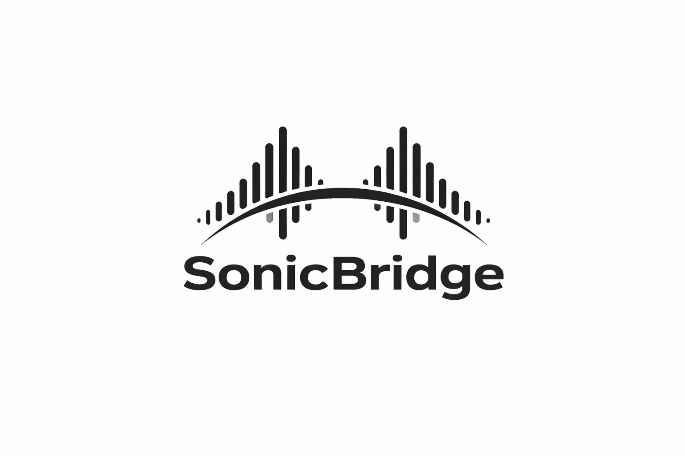

<div align="center">
  
  <br/>
  <h1>SonicBridge 🎙️⚡🌐</h1>
  <p><strong>Bridging voices through real-time AI translation.</strong></p>
</div>

---

**SonicBridge** is a highly polished, production-ready, real-time speech-to-speech translation platform. It captures live audio from a Host, processes and translates it near-instantly using Sarvam AI's localized LLMs, and broadcasts the translated speech directly into the ears of all connected Listeners with ultra-low latency.

## ✨ Key Features

- **Real-Time AI Sync & Streaming**: End-to-end latency optimized to < 1.2s using WebSockets and buffered REST endpoints.
- **Premium User Interface**: Sleek, immersive dark mode design featuring interactive micro-animations, glassmorphism, and dynamic visualizations.
- **Native Browser Audio Hardware**: Utilizes the modern `AudioWorklet` and native Web Audio API for hardware-accelerated playback and microphone isolation.
- **Multi-Lingual Broadcasts**: A single Host can speak in English while Listeners individually hear translations in Hindi, Telugu, Tamil, Kannada, Malayalam, Marathi, or Bengali simultaneously.
- **AI Hallucination Filtering**: Intelligently detects and strips out common silence-induced AI STT hallucinations (e.g., "*Yeah*", "*Okay*") before they ever reach the translation pipeline.
- **One-Click Session Sharing**: Instantly generate and copy secure room keys and URLs to invite listeners straight from the dashboard.

## 🏗️ Architecture & Tech Stack

<div align="center">
  <table>
    <tr>
      <td align="center"><strong>Frontend Interface</strong><br/><code>React + Vite</code></td>
      <td align="center"><strong>Design System</strong><br/><code>Tailwind CSS + Inter Font + Custom Utilities</code></td>
      <td align="center"><strong>Coordination Server</strong><br/><code>Node.js + ws WebSockets</code></td>
      <td align="center"><strong>AI Engine</strong><br/><code>Sarvam REST APIs API (STT, Translate, TTS)</code></td>
    </tr>
  </table>
</div>

### Why This Stack?

- **Frontend**: By heavily utilizing React Refs and WebSockets with an `arraybuffer` binary type, the UI handles 16000Hz raw PCM audio streaming completely seamlessly, avoiding browser tab crashes and performance hitches.
- **Backend / Pipeline**: The backend functions as an audio switchboard. Instead of maintaining unreliable external upstream WebSockets with AI provider endpoints, it dynamically clusters returning audio via a custom "Pseudo-WebSocket" buffering technique—trading a few milliseconds of delay for a 100% stable connection profile against REST endpoints.

## 🚀 Getting Started

### Prerequisites
- Node.js (v18+)
- Sarvam AI API Key (Get it from [sarvam.ai](https://www.sarvam.ai/))

### Environment Setup

Create a `.env` file in the `server` directory and add your key:
```env
SARVAM_API_KEY=your_sarvam_api_key_here
PORT=5000
```

### Installation

**1. Clone the repository**
```bash
git clone https://github.com/SaiDheeraj-19/SonicBridge.git
cd SonicBridge
```

**2. Start the Backend Server**
```bash
cd server
npm install
npm run dev
```

**3. Start the Frontend Application**
```bash
cd ../client
npm install
npm run dev
```

Visit `http://localhost:5173` to launch your first session.

## 🎧 How It Works

1. **Host Instantiation**: The host creates a unique 8-character cryptographic room code (`ROOM ID`).
2. **Audio Intake**: The browser captures the Host's microphone via `getUserMedia`, isolates the vocal track via WebRTC constraints, and converts the 32-bit float array into a raw 16kHz PCM data stream via a custom `audio-processor.js` Web Worker.
3. **Pipeline**: The Node.js server buffers ~1.2 second chunks of the stream, injecting RIFF headers to immediately compile them into valid `WAV` blobs in-memory for Sarvam AI.
4. **Broadcast**: The translated text strings and returning AI-generated Base64 voice audio bytes are injected backward through the WebSocket and blasted out to every authenticated participant tuned into that `ROOM ID`.

## 🛡️ License & Legal

*Your privacy is prioritized.*
Audio data is processed in real-time and is NOT stored on our servers after the session expires. Speech models are transient and bound strictly to the active room session lifecycle.

<br/>

<div align="center">
  <p className="text-[10px] opacity-20 tracking-widest uppercase">© 2026 SonicBridge Systems. v2.1.0</p>
</div>
